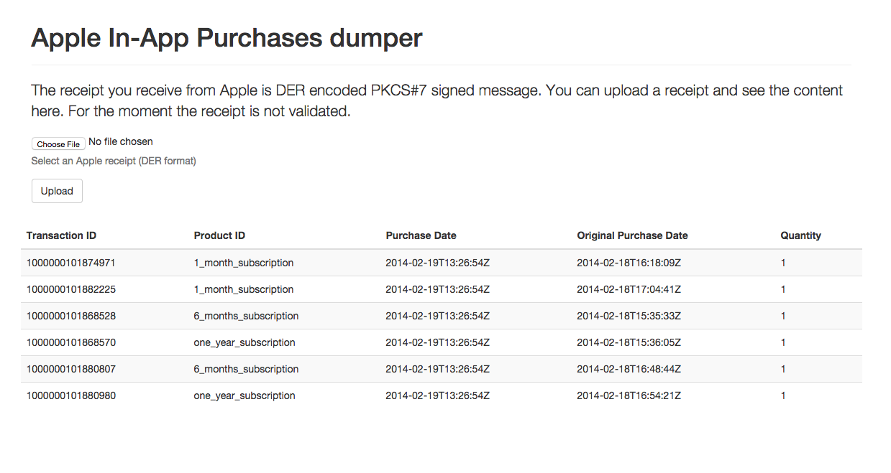

# iap-viewer-scala

A simple utility to dump the content of an In-App purchase receipt from Apple store backend. The content is validated using a local root CA certificate from Apple.

## Prerequisites

You will need [sbt][1] 0.13 or above installed.

For the webapp, you will need [Bower][2] (yep, totally un-necessary) to install the needed scripts and stylesheets.

The first time you need to run a small script to put in place some needed files, as follow:

    ./install_deps.sh

[1]: http://www.scala-sbt.org/
[2]: http://bower.io

## Testing

    sbt test

## Running

To start a web server for the application, run:

    sbt run

## License

Copyright © 2015  Stefano S
